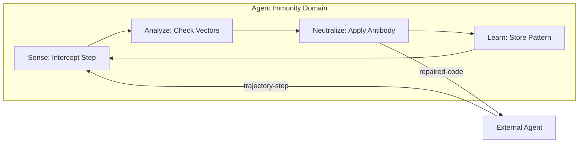
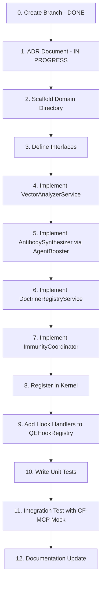

# ADR-055: Agent Immunity Domain Plugin

**Status**: Proposed  
**Date**: 2026-02-01  
**Author**: JLMA Agentic AI Team  
**SPARC Phase**: S (Specification)

---

## Context

Agent-orchestrated systems (like AQE, Claude-Flow, and CFES) face a critical challenge: **Agentic Drift**. Over time, agents may deviate from established coding standards (Doctrine), introduce performance regressions, create security vulnerabilities, or break previously stable contracts.

Current mitigation strategies are reactive (post-commit linting, CI/CD gates). This ADR proposes a **proactive, inline immune system** that:

1.  Scans agent trajectory steps **before** they are committed.
2.  Detects violations of defined "Health Vectors" (Performance, Security, Dependencies, Coherence, Truth).
3.  Synthesizes **"Antibody" patches** using the existing Agent Booster (WASM) for micro-repairs.
4.  Learns from past violations via the `QEReasoningBank` to prevent recurrence.

---

## Decision

We will implement a new **DomainPlugin** called `agent-immunity` within AQE v3. This domain will:

1.  **Integrate Natively**: Leverage the existing microkernel (`PluginLoader`, `EventBus`, `MemoryBackend`).
2.  **Follow DDD**: Reside in `src/domains/agent-immunity/` with its own interfaces, services, and coordinator.
3.  **Reuse Existing Infrastructure**:
    *   **ReasoningBank**: For pattern storage, learning, and HNSW-based similarity search.
    *   **Agent Booster**: For WASM-based code transformations (surgical repairs).
    *   **QEHookRegistry**: To intercept lifecycle events (pre-commit, post-trajectory-step).
    *   **Coherence Service**: To validate semantic intent vs. actual code changes.
4.  **Publish via API**: Expose an `AgentImmunityAPI` for programmatic checks and doctrine management.

---

## Architecture

### Core Loop (Sense → Analyze → Neutralize → Learn)



### Domain Components

| Component                 | Responsibility                                      | Reuses From        |
| :------------------------ | :-------------------------------------------------- | :----------------- |
| `ImmunityCoordinator`     | Orchestrates the Sense→Analyze→Neutralize→Learn loop | `BaseDomainPlugin` |
| `VectorAnalyzerService`   | Extensible registry for 11 health vectors           | (New)              |
| `AntibodySynthesizer`     | Generates code fixes via Agent Booster              | `AgentBoosterAdapter` |
| `DoctrineRegistryService` | Manages per-project rules                           | `MemoryBackend`    |
| `TruthScorerService`      | Validates semantic coherence                        | `CoherenceService` |

### Hooks

| Hook Event                | Source          | Action                                              |
| :------------------------ | :-------------- | :-------------------------------------------------- |
| `qe:trajectory-step`      | Claude-Flow/MCP | Intercept, scan, neutralize if needed.              |
| `qe:pre-commit`           | Git Hook        | Final gate before commit.                           |
| `qe:pattern-promoted`     | ReasoningBank   | Broadcast learned immune patterns to fleet (Hive).  |

---

## The 11 Health Vectors

The immune system analyzes trajectory steps against **11 health vectors**, organized into **Core** (always enabled) and **Extended** (opt-in per project).

### Core Vectors (5) - MVP

| #  | Vector       | Weight | Analyzer                                    | Example Violation                              |
| :- | :----------- | :----- | :------------------------------------------ | :--------------------------------------------- |
| 1  | Performance  | 0.15   | Regex scan for O(n²), sync I/O in hot paths | `fs.readFileSync` in event loop                |
| 2  | Security     | 0.25   | SAST rules, secret patterns, OWASP Top 10   | `eval()`, hardcoded JWT secret, SQL injection  |
| 3  | Dependencies | 0.15   | Lockfile hash, license audit, CVE check     | `npm install` without frozen lockfile          |
| 4  | Coherence    | 0.25   | Semantic diff (Intent vs. Code)             | Large refactor when task was "fix typo"        |
| 5  | Truth        | 0.20   | Hallucination check via SONA embeddings     | Invented API names, non-existent file paths    |

### Extended Vectors (6) - Opt-In

| #  | Vector          | Weight | Analyzer                                    | Example Violation                              |
| :- | :-------------- | :----- | :------------------------------------------ | :--------------------------------------------- |
| 6  | Cost/Tokens     | 0.10   | Token counter, loop detector                | Agent stuck in 50K token infinite loop         |
| 7  | Privacy/PII     | 0.15   | Regex for emails, SSN, credit cards         | Hardcoded PII in test fixtures                 |
| 8  | Observability   | 0.10   | AST check for logging/tracing calls         | No error handling, missing telemetry           |
| 9  | Accessibility   | 0.10   | ARIA/WCAG rules for UI components           | `<button>` without accessible label            |
| 10 | Reproducibility | 0.10   | Determinism check (random, Date.now)        | `Math.random()` without seed in test           |
| 11 | Documentation   | 0.05   | JSDoc/TSDoc presence check                  | Exported function without documentation        |

---

## Extensible Vector Architecture

The `VectorAnalyzerService` is designed as a **plugin registry** to allow adding new vectors without modifying core code:

```typescript
// src/domains/agent-immunity/interfaces.ts

export interface HealthVector {
  /** Unique vector identifier */
  readonly id: string;
  
  /** Human-readable name */
  readonly name: string;
  
  /** Weight for overall immunity score (0.0 - 1.0) */
  readonly weight: number;
  
  /** Whether this vector is enabled by default */
  readonly enabledByDefault: boolean;
  
  /** Analyze a trajectory step for violations */
  analyze(step: TrajectoryStep): Promise<VectorResult>;
}

export interface VectorResult {
  vectorId: string;
  passed: boolean;
  confidence: number;  // 0.0 - 1.0
  violations: Violation[];
  suggestedFix?: string;
}

export interface VectorAnalyzerConfig {
  /** Override default vector weights */
  weights?: Partial<Record<VectorId, number>>;
  
  /** Explicitly enable/disable vectors */
  enabled?: Partial<Record<VectorId, boolean>>;
  
  /** Minimum confidence to trigger antibody */
  confidenceThreshold?: number;  // default: 0.7
}
```

### Registration Pattern

```typescript
// src/domains/agent-immunity/services/vector-analyzer.ts

export class VectorAnalyzerService {
  private vectors: Map<string, HealthVector> = new Map();
  
  constructor(private config: VectorAnalyzerConfig = {}) {
    // Register core vectors by default
    this.register(new PerformanceVector());
    this.register(new SecurityVector());
    this.register(new DependenciesVector());
    this.register(new CoherenceVector());
    this.register(new TruthVector());
  }
  
  /** Register a new health vector (for extensions) */
  register(vector: HealthVector): void {
    this.vectors.set(vector.id, vector);
  }
  
  /** Analyze all enabled vectors */
  async analyzeAll(step: TrajectoryStep): Promise<ImmunityReport> {
    const results: VectorResult[] = [];
    
    for (const [id, vector] of this.vectors) {
      if (this.isEnabled(id)) {
        results.push(await vector.analyze(step));
      }
    }
    
    return this.computeReport(results);
  }
  
  private isEnabled(vectorId: string): boolean {
    const explicit = this.config.enabled?.[vectorId];
    if (explicit !== undefined) return explicit;
    return this.vectors.get(vectorId)?.enabledByDefault ?? true;
  }
}
```

---

## GOAP Strategy (Execution Order)



---

## Consequences

### Positive

*   **Proactive Defense**: Catches issues before they become commits.
*   **Zero Reinvention**: Leverages existing `ReasoningBank`, `AgentBooster`, and `CoherenceService`.
*   **Fleet Learning**: Patterns learned by one agent benefit all agents via `cf_hive`.
*   **Modular**: Can be disabled per-project via `Kernel` config.

### Negative

*   **Latency**: Adds processing overhead to each trajectory step (target: <50ms).
*   **Complexity**: Introduces a 14th domain to the AQE kernel.

### Risks

*   **False Positives**: Overly strict doctrine rules may block valid agent actions.
*   **Mitigation**: Introduce a "confidence threshold" and human-in-the-loop for low-confidence blocks.

---

## Verification Plan

### Automated Tests

1.  **VectorAnalyzerService**: Unit tests for all 11 vectors.
2.  **AntibodySynthesizer**: Test WASM transform success rates.
3.  **ImmunityCoordinator**: Integration test for full loop.
4.  **Latency Benchmark**: Ensure `<50ms` per trajectory step (core vectors only).
5.  **Extension Test**: Verify custom vector registration works.

### Manual Verification

1.  Run `aqe mcp` server in a Claude-Flow swarm.
2.  Introduce a deliberate doctrine violation (e.g., `var` instead of `const`).
3.  Verify the agent receives a repair suggestion before committing.

---

## References

*   [ADR-021: QE ReasoningBank](./analysis/ADR-021.md)
*   [ADR-047: Min-Cut GOAP](./plans/ADR-047-mincut-goap-plan.md)
*   [ADR-051: Unified Storage](./ADR-051-STORAGE-COMPLETE.md)
*   [Ruvnet Doctrine Skill](/workspaces/jlmaworkspace/.agent/skills/ruvnet/SKILL.md)
