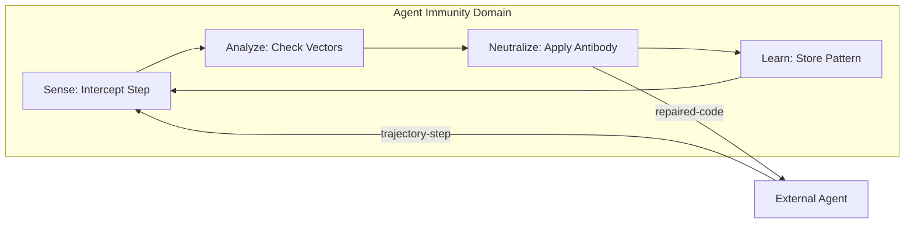
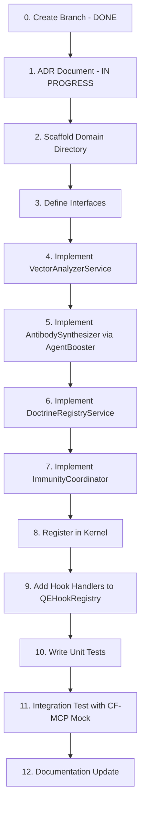

# ADR-055: Agent Immunity Domain Plugin

**Status**: Proposed  
**Date**: 2026-02-01  
**Author**: JLMA Agentic AI Team  
**SPARC Phase**: S (Specification)

---

## Context

Agent-orchestrated systems (like AQE, Claude-Flow, and CFES) face a critical challenge: **Agentic Drift**. Over time, agents may deviate from established coding standards (Doctrine), introduce performance regressions, create security vulnerabilities, or break previously stable contracts.

Current mitigation strategies are reactive (post-commit linting, CI/CD gates). This ADR proposes a **proactive, inline immune system** that:

1.  Scans agent trajectory steps **before** they are committed.
2.  Detects violations of defined "Health Vectors" (Performance, Security, Dependencies, Coherence, Truth).
3.  Synthesizes **"Antibody" patches** using the existing Agent Booster (WASM) for micro-repairs.
4.  Learns from past violations via the `QEReasoningBank` to prevent recurrence.

---

## Decision

We will implement a new **DomainPlugin** called `agent-immunity` within AQE v3. This domain will:

1.  **Integrate Natively**: Leverage the existing microkernel (`PluginLoader`, `EventBus`, `MemoryBackend`).
2.  **Follow DDD**: Reside in `src/domains/agent-immunity/` with its own interfaces, services, and coordinator.
3.  **Reuse Existing Infrastructure**:
    *   **ReasoningBank**: For pattern storage, learning, and HNSW-based similarity search.
    *   **Agent Booster**: For WASM-based code transformations (surgical repairs).
    *   **QEHookRegistry**: To intercept lifecycle events (pre-commit, post-trajectory-step).
    *   **Coherence Service**: To validate semantic intent vs. actual code changes.
4.  **Publish via API**: Expose an `AgentImmunityAPI` for programmatic checks and doctrine management.

---

## Architecture

### Core Loop (Sense → Analyze → Neutralize → Learn)

### Domain Components

| Component                 | Responsibility                                      | Reuses From        |
| :------------------------ | :-------------------------------------------------- | :----------------- |
| `ImmunityCoordinator`     | Orchestrates the Sense→Analyze→Neutralize→Learn loop | `BaseDomainPlugin` |
| `VectorAnalyzerService`   | Checks 5 health vectors                             | (New)              |
| `AntibodySynthesizer`     | Generates code fixes via Agent Booster              | `AgentBoosterAdapter` |
| `DoctrineRegistryService` | Manages per-project rules                           | `MemoryBackend`    |
| `TruthScorerService`      | Validates semantic coherence                        | `CoherenceService` |

### Hooks

| Hook Event                | Source          | Action                                              |
| :------------------------ | :-------------- | :-------------------------------------------------- |
| `qe:trajectory-step`      | Claude-Flow/MCP | Intercept, scan, neutralize if needed.              |
| `qe:pre-commit`           | Git Hook        | Final gate before commit.                           |
| `qe:pattern-promoted`     | ReasoningBank   | Broadcast learned immune patterns to fleet (Hive).  |

---

## The 5 Health Vectors

| Vector       | Analyzer                                           | Example Violation                                     |
| :----------- | :------------------------------------------------- | :---------------------------------------------------- |
| Performance  | Regex scan for O(n²), sync I/O in hot paths        | `fs.readFileSync` in event loop                       |
| Security     | SAST rules, secret patterns, OWASP Top 10          | `eval()`, hardcoded JWT secret, SQL injection         |
| Dependencies | Lockfile hash check, license audit                 | `npm install` without frozen lockfile                 |
| Coherence    | Semantic diff (Intent vs. Code)                    | Large refactor when task was "fix typo"               |
| Truth        | Hallucination check via SONA embeddings            | Invented API names, non-existent file paths           |

---

## GOAP Strategy (Execution Order)

---

## Consequences

### Positive

*   **Proactive Defense**: Catches issues before they become commits.
*   **Zero Reinvention**: Leverages existing `ReasoningBank`, `AgentBooster`, and `CoherenceService`.
*   **Fleet Learning**: Patterns learned by one agent benefit all agents via `cf_hive`.
*   **Modular**: Can be disabled per-project via `Kernel` config.

### Negative

*   **Latency**: Adds processing overhead to each trajectory step (target: <50ms).
*   **Complexity**: Introduces a 14th domain to the AQE kernel.

### Risks

*   **False Positives**: Overly strict doctrine rules may block valid agent actions.
*   **Mitigation**: Introduce a "confidence threshold" and human-in-the-loop for low-confidence blocks.

---

## Verification Plan

### Automated Tests

1.  **VectorAnalyzerService**: Unit tests for each of the 5 vectors.
2.  **AntibodySynthesizer**: Test WASM transform success rates.
3.  **ImmunityCoordinator**: Integration test for full loop.
4.  **Latency Benchmark**: Ensure `<50ms` per trajectory step.

### Manual Verification

1.  Run `aqe mcp` server in a Claude-Flow swarm.
2.  Introduce a deliberate doctrine violation (e.g., `var` instead of `const`).
3.  Verify the agent receives a repair suggestion before committing.

---

## References

*   [ADR-021: QE ReasoningBank](./analysis/ADR-021.md)
*   [ADR-047: Min-Cut GOAP](./plans/ADR-047-mincut-goap-plan.md)
*   [ADR-051: Unified Storage](./ADR-051-STORAGE-COMPLETE.md)
*   [Ruvnet Doctrine Skill](/workspaces/jlmaworkspace/.agent/skills/ruvnet/SKILL.md)
